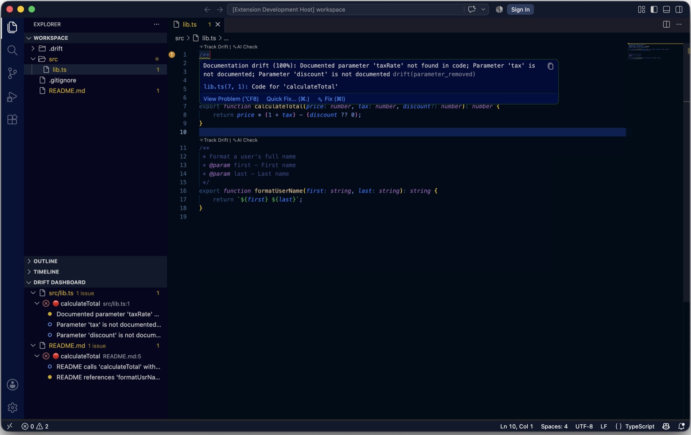

# Drift - Documentation Sync Detector


[](https://marketplace.visualstudio.com/items?itemName=pallaprolus.drift)
[](https://marketplace.visualstudio.com/items?itemName=pallaprolus.drift)
[](https://marketplace.visualstudio.com/items?itemName=pallaprolus.drift&ssr=false#review-details)
[](https://open-vsx.org/extension/pallaprolus/drift)
[](https://www.npmjs.com/package/docs-drift)
[](https://github.com/pallaprolus/drift/actions/workflows/test.yml)
[](LICENSE)

**Drift** detects when your documentation drifts out of sync with your code. It pairs documentation blocks (JSDoc, docstrings, README code blocks, etc.) with their code anchors and flags potential staleness when the code changes.



One engine, three ways to run it:

| Surface | Best for | Install |
|---------|----------|---------|
| [**VS Code extension**](#vs-code-extension) | Seeing drift while you edit: dashboard, gutter marks, hovers, quick fixes, AI checks | [Marketplace](https://marketplace.visualstudio.com/items?itemName=pallaprolus.drift) · [Open VSX](https://open-vsx.org/extension/pallaprolus/drift) · `code --install-extension pallaprolus.drift` |
| [**Command line**](#command-line) (`docs-drift`) | Pre-commit hooks, local audits, any CI system | `npx docs-drift` |
| [**GitHub Action**](#github-action) | Failing pull requests that leave docs behind, with a job summary | `uses: pallaprolus/drift@v0` |

All three share the same parsers, analyzers, thresholds, [ignore markers, and review state](#shared-behavior), so CI reports the same findings the editor shows. The one editor-only capability is the on-demand AI check.

## What Drift Checks

### Signatures against their documentation

- **Parameter mismatches** - Documentation mentions parameters that don't exist, or code has undocumented parameters
- **Return type drift** - Documented return types that don't match the code
- **Renamed identifiers** - Documented names that may have been renamed in code
- **Description references** - References to code elements in descriptions that no longer exist

### README and docs code blocks

Fenced code blocks in `README.md` and `docs/**/*.md` are cross-checked against the real code:

- **Renamed symbols** - The README calls `formatUsrName()` but the code now defines `formatUserName()`
- **Stale signatures** - A `function calculateTotal(price, taxRate)` example when the code has `(price, tax, discount)`
- **Wrong argument counts** - `calculateTotal(10)` when the function needs two arguments
- **Removed functions** - Examples that document a function that no longer exists

### Git history

In a Git repository, Drift uses `git blame` and the working-tree diff to catch drift that signature matching cannot see:

- **Uncommitted code edits** whose documentation was not touched
- **Docs older than the code** - code committed more than a configurable number of days after the docs last changed

No extra setup: it works with the `git` on your `PATH` and is cached per file.

### Meaning, with an AI model (opt-in, on demand)

Signature checks can't tell you that a docstring says "throws when missing" while the code now returns `undefined`. For that, the [extension](#ai-checks) can ask an AI model. Drift never sends code to a model automatically; every check is one you trigger.

### Supported languages

- TypeScript / JavaScript (JSDoc)
- Python (Sphinx, Google, and NumPy docstrings)
- Go
- Rust
- Java (Javadoc)
- Markdown code blocks in README and docs (cross-checked against the languages above)

Each doc-code pair gets a drift score from 0 to 1 and a severity: 🔴 critical, 🟠 high, 🟡 medium, ⚪ low. See [How It Works](#how-it-works).

## VS Code Extension

### Install

Search for "Drift - Documentation Sync Detector" in the Extensions view (Ctrl+Shift+X, or Cmd+Shift+X on macOS), or:

```bash
code --install-extension pallaprolus.drift
```

Also on [Open VSX](https://open-vsx.org/extension/pallaprolus/drift) for Cursor, VSCodium, and other editors that use that registry. Requires VS Code 1.90 or later.

### Where findings appear

- **Dashboard** - A sidebar view of all drift issues, grouped by file and sorted by severity. Opens automatically after a workspace scan.
- **Gutter icons and inline decorations** - Markers in the editor margin and subtle highlights on potentially stale documentation.
- **Hovers** - Detailed drift analysis on hover, with quick actions.
- **CodeLens** - "Track Drift", "Review & Sync", and the drift percentage above each documented symbol.
- **Problems panel** - Findings are published as diagnostics with source `drift`, so they show up alongside your linters and in the editor's error navigation. Turn this off with `drift.showInProblems`.

### Scanning

- **Drift: Scan Workspace for Documentation Drift** scans every supported file plus README and docs code blocks, then opens the dashboard.
- **Drift: Scan Current File** scans only the active file.
- Open files are re-scanned as you edit, with a short delay.

### Review workflow

- **Mark as Reviewed** from the hover, the CodeLens, or the dashboard's context menu dismisses a finding. Drift remembers reviewed items across sessions and brings a finding back only when the code changes again.
- **Quick Fixes** (the lightbulb) add missing or remove stale parameter tags in JSDoc, Javadoc, Python, and Rust documentation.

### AI checks

1. Place the cursor on a documented function and run **Drift: AI Check Documentation at Cursor**, or click the **AI Check** CodeLens. **Drift: AI Check All Documentation in Current File** runs it for every documented symbol in the file.
2. The first time, VS Code asks for permission to use a language model (if you use GitHub Copilot or another chat provider), or run **Drift: Set Anthropic API Key** to use the Anthropic API with your own key.
3. Findings join the hover, dashboard, Problems panel, and reports like any other drift reason.

Provider notes:

- `drift.ai.provider` is `auto` by default: the Anthropic API when a key has been saved, otherwise the VS Code Language Model API. Set it to `off` to hide the AI CodeLens entirely.
- The Anthropic key lives in VS Code's encrypted secret storage, never in settings files.
- Only the documentation block and the function body you check are sent. Nothing is sent without an explicit command or CodeLens click.

### Export reports

**Drift: Export Report** (also on the dashboard toolbar) writes the current findings as **Markdown** for pull requests and wikis, a self-contained **HTML** page, or **JSON** for pipelines.

### Commands

| Command | Description |
|---------|-------------|
| `Drift: Scan Workspace for Documentation Drift` | Scan all files and README/docs code blocks |
| `Drift: Scan Current File` | Scan only the active file |
| `Drift: Mark as Reviewed` | Mark documentation as reviewed |
| `Drift: Show Staleness Dashboard` | Open the Drift Dashboard sidebar |
| `Drift: Refresh Dashboard` | Re-scan and update the dashboard |
| `Drift: Export Report (Markdown, HTML, JSON)` | Save findings as Markdown, HTML, or JSON |
| `Drift: AI Check Documentation at Cursor` | Ask an AI model whether the docs still describe the function |
| `Drift: AI Check All Documentation in Current File` | Run the AI check for every documented symbol in the file |
| `Drift: Set Anthropic API Key` | Store an Anthropic key in secret storage for AI checks |
| `Drift: Clear Anthropic API Key` | Remove the stored key |

### Settings

```json
{
  // Show gutter icons for drift warnings
  "drift.enableGutterIcons": true,

  // Show inline decorations
  "drift.enableInlineDecorations": true,

  // Publish findings to the Problems panel
  "drift.showInProblems": true,

  // Files/folders to exclude from scanning
  "drift.excludePatterns": [
    "**/node_modules/**",
    "**/dist/**",
    "**/build/**",
    "**/.git/**"
  ],

  // Languages to scan
  "drift.supportedLanguages": [
    "javascript",
    "typescript",
    "javascriptreact",
    "typescriptreact",
    "python",
    "go",
    "java",
    "rust"
  ],

  // Minimum drift score (0-1) to show warnings
  "drift.driftThreshold": 0.3,

  // Check README / docs code blocks against the code
  "drift.scanMarkdown": true,
  "drift.markdownPatterns": ["**/README.md", "**/docs/**/*.md"],

  // Git-based change tracking
  "drift.git.enabled": true,
  "drift.git.staleDays": 30,

  // AI semantic checks: "auto" | "anthropic" | "vscode" | "off"
  "drift.ai.provider": "auto",
  "drift.ai.model": "claude-opus-5"
}
```

## Command Line

`docs-drift` runs the same checks outside the editor, for pre-commit hooks, local audits, and any CI system.

```bash
npx docs-drift --fail-on high
```

Or install it globally with `npm install -g docs-drift`.

```text
src/lib.ts
  !! 7: calculateTotal (critical, 100%)
       - Documented parameter 'taxRate' not found in code
       - Parameter 'discount' is not documented

1 issue(s) in 1 file(s): 1 critical, 0 high, 0 medium, 0 low
```

| Option | Description |
|--------|-------------|
| `[paths...]` | Directories or files to scan (default: current directory) |
| `--format text\|markdown\|html\|json` | Output format (default `text`) |
| `--output <file>` | Write the report to a file instead of stdout |
| `--threshold <0-1>` | Minimum drift score to report (default `0.3`) |
| `--fail-on low\|medium\|high\|critical\|none` | Exit with 1 when an issue at or above this severity exists (default `low`) |
| `--exclude <glob>` | Extra glob to skip; repeatable |
| `--no-git`, `--no-markdown`, `--no-gitignore` | Skip the Git checks, the Markdown checks, or the root `.gitignore` |
| `--markdown <glob>` | Markdown files to check; repeatable (default README.md and docs/**/*.md) |
| `--stale-days <n>` | Days after which code newer than its docs is flagged (default `30`) |
| `--quiet` | No progress output on stderr |

Exit codes: `0` no drift at or above `--fail-on`, `1` drift found, `2` bad arguments or a path that doesn't exist. It honors `.gitignore` and the review state in `.drift/state.json`. Requires Node 18 or later.

## GitHub Action

The action runs `docs-drift` on the checked-out tree, prints the report in the job log, writes a Markdown report to the job summary, and fails the job when drift at or above `fail-on` is found.

```yaml
name: Docs drift
on:
  pull_request:
  push:
    branches: [main]

jobs:
  drift:
    runs-on: ubuntu-latest
    steps:
      - uses: actions/checkout@v4
        with:
          fetch-depth: 0        # full history lets the Git checks work
      - uses: pallaprolus/drift@v0   # or pin a release tag such as v0.7.4
        with:
          fail-on: high
```

| Input | Default | Description |
|-------|---------|-------------|
| `fail-on` | `low` | `low`, `medium`, `high`, `critical`, or `none` (report only) |
| `threshold` | `0.3` | Minimum drift score to report |
| `path` | `.` | Directory or file to scan |
| `args` | | Extra `docs-drift` arguments, for example `--exclude "**/fixtures/**" --no-git` |
| `summary` | `true` | Write the Markdown report to the job summary |

A common rollout: start with `fail-on: none` to see the summary on a few pull requests, fix or ignore what's there, then switch to `high`.

## Shared Behavior

These apply to the extension, the CLI, and the Action alike.

### Ignore markers

Some mismatches are intentional. Opt out without changing the docs:

<!-- drift-ignore -->
```typescript
// drift-ignore
/**
 * Kept for backwards compatibility; the second argument is intentionally undocumented.
 */
function legacy(a: string, b?: string) {}
```

- `drift-ignore` on the line above a doc block, or anywhere inside it, skips that pair
- `drift-ignore-file` in the first lines of a file skips the whole file
- `<!-- drift-ignore -->` above a fenced code block in Markdown skips that block

### Review state

Marking a finding as reviewed in the extension records it in `.drift/state.json` together with a hash of the code it was reviewed against. Commit that file and the CLI and Action honor it too; a reviewed finding returns only when the code changes again.

### Scoring

Each doc-code pair receives a drift score from 0 to 1 based on the number and severity of mismatches, the kind of drift (parameters weigh more than return types or descriptions), and the confidence of the detection. Findings below `driftThreshold` (0.3 by default) are not reported.

## How It Works

### 1. Parse doc-code pairs

Drift parses your source files to identify documentation blocks and their associated code:

<!-- drift-ignore -->
```typescript
/**
 * Calculate the total price with tax
 * @param price - The base price
 * @param taxRate - The tax rate as a decimal
 * @returns The total price including tax
 */
function calculateTotal(price: number, taxRate: number): number {
  return price * (1 + taxRate);
}
```

### 2. Analyze for drift

When you modify the code, Drift detects potential documentation issues:

<!-- drift-ignore -->
```typescript
/**
 * Calculate the total price with tax
 * @param price - The base price          // ✓ Still valid
 * @param taxRate - The tax rate          // ⚠️ Parameter renamed to 'tax'
 * @returns The total price including tax
 */
function calculateTotal(price: number, tax: number, discount?: number): number {
  //                                      ^^^           ^^^^^^^^
  //                           Parameter renamed    New undocumented parameter
  return (price * (1 + tax)) - (discount || 0);
}
```

### 3. Score and report

The mismatches above push `calculateTotal` into the critical band, so it appears in the dashboard, the Problems panel, the CLI output, and the Action's job summary until the docs are updated or the finding is reviewed.

## Contributing

Contributions are welcome! Open an issue first for larger changes so we can agree on the approach.

### Development setup

```bash
# Clone the repository
git clone https://github.com/pallaprolus/drift.git
cd drift

# Install dependencies
npm install

# Compile the extension
npm run compile

# Run in development mode
code --extensionDevelopmentPath=.

# Run the unit tests
npm run test:unit

# Build and try the CLI
npm run build:cli && node dist/cli.js .
```

### Releasing

Releases are automated. Bump `version` in `package.json` (and add a section to `CHANGELOG.md`), push to `main`, and the Publish workflow runs the tests, publishes the extension to the VS Code Marketplace and Open VSX, publishes the CLI to npm as `docs-drift` with provenance, tags `vX.Y.Z` and moves the floating `v0` tag, and creates a GitHub release with the `.vsix` attached. A version whose tag already exists is never republished.

### Adding language support

1. Create a new parser in `src/parsers/` extending `BaseParser`
2. Implement `parseDocCodePairs()` and `extractCodeSignature()`
3. Register the parser in `ParserRegistry`

Parsers and analyzers must not import the `vscode` module, so the same code runs in the CLI.

## Community & Impact

Drift exists to keep documentation trustworthy. If it saved you time or caught a bug, [open an issue](https://github.com/pallaprolus/drift/issues) with the story; real examples shape what gets built next.

- **Used in a project?** Add a badge to your README: `[](https://marketplace.visualstudio.com/items?itemName=pallaprolus.drift)`
- **Running it in CI?** The GitHub Action above keeps documentation drift out of pull requests.

## License

MIT License - see [LICENSE](LICENSE) for details.

---

**Found a bug or have a suggestion?** [Open an issue](https://github.com/pallaprolus/drift/issues)
